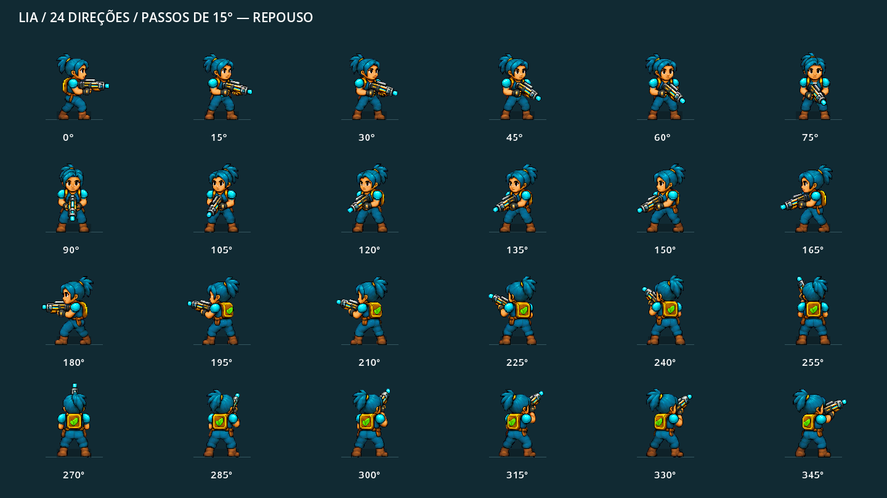

# Protocolo 17 — Aurora

Alpha em Godot: Lia recupera os sistemas do Distrito das Águas enquanto enfrenta drones e investiga o colapso de Aurora. Esta versão contém quatro setores, combate, esquiva, reparos, melhorias e confronto final.

## Executar

1. Abra `project.godot` no **Godot 4.7.1**, versão usada na validação.
2. Aguarde a importação dos recursos.
3. Pressione **F5** para iniciar.

O projeto usa o renderer Compatibility. Saves e configurações ficam em `user://`; não fazem parte do repositório. Não há dependências externas para jogar.

## Controles

| Ação | Controle |
| --- | --- |
| Movimento | WASD ou setas |
| Mira | Mouse |
| Disparo | Botão esquerdo ou Espaço |
| Esquiva | Shift |
| Reparar | Segurar E próximo ao sistema |
| Mapa | M |
| Pausa | Esc |
| Tela cheia | F11 |
| Alternar áudio | F10 |

## Lia: 24 direções

A personagem armada possui **24 orientações em intervalos de 15°**, com oito quadros de caminhada por direção, repouso, respiração e piscada. Os 240 quadros mantêm corpo, mãos e arma integrados. A mira e os tiros reais continuam livres em 360°.



Abra [a prévia animada](captures/lia_24_preview.html) em um navegador após clonar o projeto. Ela reproduz capturas do próprio Godot e permite reduzir a velocidade da caminhada.

[Documentação dos sprites](assets/lia_directional/README.md) · [Prompts de geração](assets/lia_directional/PROMPTS.md) · [Fontes e proveniência](assets/lia_directional/SOURCES.json).

## Inimigos animados

Explorador, sentinela, unidade de investida e chefe de contenção agora usam arte própria no estilo da Lia: **64 quadros em oito direções**, recuo, preparação luminosa, reação a dano e destruição em fragmentos. Cada tipo possui sons de detecção, preparação, ataque, impacto e destruição — **20 efeitos originais**.

[Arte, animações, sons e instruções da prévia](assets/enemies/README.md) · [Prompts de geração](assets/enemies/PROMPTS.md).

## Estação de tratamento

O Distrito das Águas usa o conceito aprovado de concreto gasto, água azul-petróleo, cobre e vegetação de áreas úmidas. Piso, tanques, filtros, bombas, salas técnicas e os quatro totens aparecem no jogo; os totens mudam de estado quando cada sistema é restaurado. Juncos e plantas aquáticas ficam nas margens, deixando as rotas de combate visíveis. A geometria e as colisões originais permanecem.

[Arte e proveniência](assets/station/README.md) · [Prompts](assets/station/PROMPTS.md). Para ver capturas dos quatro setores e de um totem restaurado, execute `godot --path . --script tools/review_station.gd`.

## Estruturas modulares

O Pátio de Energia contém a primeira estrutura reutilizável completa em `scenes/structures/energy_station.tscn`. A estação possui colisões separadas para sala técnica e gerador, terminal acessível, obstáculo de navegação, profundidade por Y, estados offline/partida/online, luz, partículas, animação e ruído de operação por proximidade. O objetivo e o contador do HUD usam a progressão existente.

[Arquitetura e guia para novas estruturas](docs/structures.md). Execute `godot --path . --script tools/review_energy_station.gd` para gerar as três capturas de revisão.

## Validação

Na raiz do projeto, substitua `godot` pelo caminho do executável instalado:

```sh
godot --headless --path . --editor --import --quit
godot --path . --script tests/test_weapon_visual.gd
godot --headless --path . --script tests/test_lia_animation.gd
godot --headless --path . --script tests/test_lia_official.gd
godot --headless --path . --script tests/test_world.gd
godot --headless --path . --script tests/test_simulation.gd
godot --headless --path . --script tests/test_shot_origin.gd
godot --headless --path . --script tests/test_enemy_presentation.gd
godot --headless --path . --script tests/test_energy_station.gd
```

Resultados da integração direcional: 3752 verificações visuais, 22 do relógio de animação, 97 dos recursos oficiais e 2405 do mundo aprovadas. O teste visual requer renderer gráfico para gerar as capturas e verificar a cena real.

Na revisão de 27/09, os disparos da Lia partem do cano, com 962 verificações aprovadas. O cenário inválido do teste de parede foi corrigido: simulação **91/91**, com as quatro etapas concluídas pelo bot. A apresentação dos inimigos passou em 251 verificações adicionais e na renderização da cena real. O áudio gerado foi verificado quanto a diversidade dos efeitos e ausência de clipping.

## Organização

- `scripts/`: simulação, apresentação, áudio e interface.
- `scenes/`: cena principal.
- `assets/lia_directional/`: apresentação armada atual da Lia.
- `assets/enemies/`: quatro atlas dos inimigos, recortes, prompts e proveniência.
- `assets/station/`: atlas das estruturas, totens, vegetação e piso da estação.
- `assets/lia_official/` e `assets/lia_expanded/`: referências e versões anteriores preservadas.
- `tests/`: verificações do mundo, combate e apresentação.
- `tools/`: extração dos atlas e capturas de desenvolvimento.
- `captures/`: revisão visual da versão atual.

Os atlas prontos são usados diretamente pelo jogo. As ferramentas de extração não precisam ser executadas para jogar.

A manutenção com ferramenta conserva suas quatro poses oficiais anteriores.

## Integração do ambiente — rodada 02

As três pontes e o píer foram reconstruídos com módulos próprios: grade, vigas,
guarda-corpos, pilares e encaixes. Os recortes das máquinas, totens e props agora
incluem suas silhuetas completas. Gerador e coletor usam contornos do atlas que
excluem partes das máquinas vizinhas sem deformar os pixels. A máscara retangular
do gerador desligado foi removida. Colisão e profundidade continuam pela base.

Consulte [dados, desenho e validação](docs/environment_integration.md).
Execute `godot --headless --path . --script tests/test_asset_silhouettes.gd` para
verificar silhuetas, contornos e escala; `godot --path . --script tools/review_environment_integration.gd --audio-driver Dummy`
para 20 capturas e percursos renderizados da Lia; e
`godot --path . --script tools/review_asset_silhouettes.gd --audio-driver Dummy`
para três pranchas de checagem, sem HUD cobrindo as máquinas.

## Água — revisão 03

Canais e reservatórios abertos agora usam água animada com profundidade junto às
margens, corrente orientada, ondulações discretas, sombra sob pontes e contato com
vegetação. O shader é leve; os campos do mapa são construídos uma vez. As colisões
e a progressão permanecem iguais. Consulte [desenho, manutenção e validação](docs/water_visuals.md).
