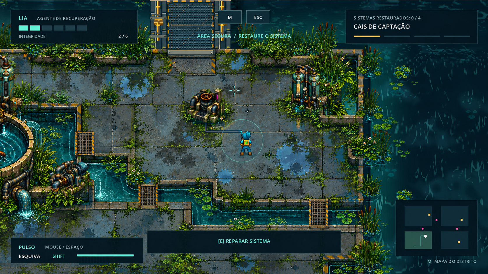

# Distrito das Águas — direção visual

Proposta baseada no contexto narrativo fornecido e nas três capturas atuais. A imagem-conceito é uma visualização de intenção artística gerada com imagegen; não representa uma captura do jogo nem um conjunto de sprites pronto para importar. A pasta inicialmente examinada continha apenas a configuração do Godot. Após aprovação da proposta, o jogo completo foi localizado em uma pasta vizinha e copiado para este projeto. A primeira implementação está descrita em [implementacao.md](implementacao.md), com capturas reais do renderer.

## Identidade dominante

Uma estação hídrica de Aurora transformada em um jardim de filtragem parcialmente alagado. A cidade ainda é reconhecível na geometria das plataformas, comportas e tubulações; a natureza ocupa as falhas dessa organização. O abandono deve aparecer em vazamentos, linhas de cheia, corrosão e raízes, e a possibilidade de recuperação deve aparecer na circulação da água e nos sinais de atividade dos sistemas.

## Diagnóstico das capturas

O problema principal é a distribuição das massas visuais: o piso bege, repetitivo e muito texturizado ocupa quase todo o campo jogável. A água está nas bordas, e as plantas aparecem sobretudo como pequenos elementos separados. As máquinas têm boa identidade hídrica, mas ficam isoladas numa superfície contínua, sem uma rede espacial que explique sua função. Acrescentar detalhes sobre esse mesmo piso preservaria a leitura de praça seca.

Preservar o tanque circular, as bombas, os filtros verticais, as pontes industriais, Lia e a linguagem do HUD. Esses elementos já sustentam a identidade do jogo.

## Composição aplicada ao cais mostrado

1. **Tanque à esquerda:** manter como marco do setor. Conectar sua saída a um canal visível, com queda d'água localizada, tubulação de bombeamento e marcas de umidade nas bases. A saída precisa indicar um destino.
2. **Faixa inferior e lateral:** introduzir canal de serviço que desemboca no reservatório à direita. Quebrar o grande retângulo de pavimento em plataformas ligadas por travessias metálicas. A posição final depende do mapa de colisões e dos corredores de combate.
3. **Centro, Lia e terminal:** conservar uma plataforma ampla, com piso menos contrastado e menos detalhes. Poças rasas, juntas escuras e musgo localizado dão umidade sem transformar toda a arena em obstáculo.
4. **Filtros no alto à direita:** agrupar em uma base de manutenção ao lado de um leito de filtragem vegetado. Mostrar alimentação, saída e acesso técnico; a vegetação cresce na borda e ao redor das bases.
5. **Ponte ao norte:** manter o acesso claramente visível, com faixa de segurança desgastada e vegetação nas laterais, sem cobrir a entrada.
6. **Margem direita:** substituir a repetição de tufos por grupos de tamanhos diferentes. Alternar trechos de cais exposto, juncos densos e recantos com plantas flutuantes.

## Solo e margens

Criar famílias de concreto úmido, piso de manutenção relativamente seco, grelha metálica e sedimento exposto nas margens. Usar variações de cor em áreas maiores antes de adicionar pequenas manchas. O concreto deve tender a cinza azulado e verde mineral; o bege fica restrito a sedimentos e trechos antigos.

As poças devem ter contorno próprio, reflexos discretos e aparência diferente da água profunda. Nas margens, usar transições reconhecíveis: plataforma, borda de contenção, faixa escurecida pela água, limo e água. Vegetação pode ocultar partes dessa sequência, mas a borda navegável precisa permanecer legível.

## Água e vegetação

Separar água profunda azul-petróleo, circulação turquesa e recantos rasos esverdeados. As ondas e folhas ajudam a diferenciar corrente e repouso. Concentrar espuma e brilho nos pontos de vazão; reservar folhas flutuantes e algas para cantos protegidos.

Criar massas de juncos e taboas junto aos canais; samambaias e plantas baixas em bases úmidas; musgo em juntas e paredes; raízes em pavimentos rompidos. Variar altura, densidade e tamanho dos grupos. Manter intervalos de piso e estruturas expostas para que a natureza invada uma cidade ainda reconhecível.

Evitar distribuição aleatória uniforme e evitar texturas muito contrastadas no centro das áreas de combate. O volume visual pode ser maior que o volume de colisão, mas cada planta precisa deixar claro se bloqueia ou apenas decora.

## Paleta de partida

| Papel | Cor sugerida | Uso |
|---|---|---|
| Água profunda | `#103943` | Reservatório e profundidade |
| Água em circulação | `#268D95` | Canais e saídas |
| Concreto úmido | `#607980` | Base do piso jogável |
| Vegetação em sombra | `#28533D` | Massas e contornos |
| Vegetação iluminada | `#7FA64B` | Folhas e brotos localizados |
| Corrosão | `#99623F` | Metal e ruína |
| Segurança | `#D5AD54` | Travessias e marcações |

São referências para testes, não uma substituição automática da paleta existente. Como Lia e o HUD já usam ciano, manter o entorno imediato menos saturado e mais escuro. O brilho das águas deve ser localizado para não competir com projéteis e interação.

## Infraestrutura e narrativa

Mostrar uma cadeia funcional reconhecível: captação → bombeamento → filtragem → distribuição. Usar conexões entre máquinas, comportas, dutos, grelhas e canais para explicar essa cadeia no cenário.

Distribuir degradação de acordo com a causa: limo próximo à água, ferrugem em juntas e fixações, vegetação em vazamentos e raízes em pavimento rompido. Após a restauração de um setor, ativar um sinal visível e pequeno — vazão na saída, indicador do equipamento ou comporta funcionando. Não remover toda a vegetação nem apagar a história do local.

## Atmosfera e leitura de jogo

Preferir reflexos e animações discretas a uma névoa global. Ondulações curtas nas saídas, gotejamento em juntas e movimento leve de poucos grupos de plantas bastam para transmitir vida. Som localizado de água e bombas pode reforçar a leitura quando houver implementação.

Água profunda é barreira, com borda visível; poça rasa é piso; ponte é travessia. Não introduzir canais apenas como pintura sobre chão transitável. Conservar espaço para esquiva, circulação dos drones, linhas de tiro e aproximação do terminal. Confirmar a leitura no tamanho real da tela, durante o combate e com o HUD presente.

## Ordem de implementação

1. Fazer uma versão simplificada das plataformas, canais e travessias. Validar movimento, acesso ao terminal e combate antes do detalhamento.
2. Trocar a dominância do piso bege por concreto úmido e construir as transições das margens. Comparar capturas equivalentes com a versão atual.
3. Conectar visualmente os sistemas e distribuir grandes grupos de vegetação nas zonas úmidas.
4. Acrescentar variações do piso, vazamentos, corrosão, animação e resposta visual à restauração.

Começar pelo recorte do cais mostrado na terceira captura. Produzir um pequeno conjunto modular: piso úmido e suas variações; bordas e cantos de canal; travessia metálica; poças; grupos de vegetação baixa e alta; conexões de tubulação; saída de água. Expandir para os demais setores somente depois de validar o recorte.

Critérios de revisão: a presença hídrica deve continuar evidente com o HUD oculto; deve ser possível reconhecer o caminho até o terminal imediatamente; Lia, drones e projéteis devem se destacar; a vegetação deve formar grupos ligados a água e falhas da infraestrutura; os setores devem sugerir funções diferentes sem perder a unidade do distrito.

## Registro da imagem-conceito

Gerada pela ferramenta integrada imagegen usando a terceira captura como alvo. O prompt completo está em `distrito-das-aguas-prompt.txt`. A imagem orienta composição, paleta e distribuição das massas; requer adaptação para sprites, escala, colisões e layout reais.
